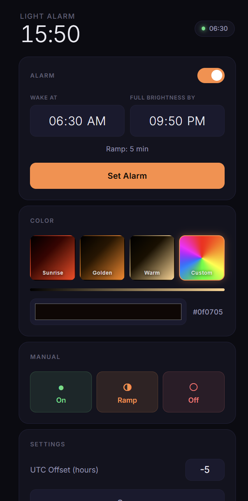

# light-alarm

A sunrise alarm clock built on an ESP32. At a scheduled time, it gradually ramps a BLE LED strip from black through deep red and orange to a warm sunrise color — mimicking natural sunrise to wake you up without a harsh alarm.

The web UI is served directly from the ESP32 over your local network. No app, no cloud, no external hosting.



---

## Features

- **Scheduled sunrise** — set a wake time and the ESP32 triggers automatically via NTP, no phone required overnight
- **Cubic ease-in ramp** — brightness follows a `t³` curve so the light stays dim for most of the ramp and brightens sharply near the end, matching real sunrise
- **Configurable duration** — set wake time and full-brightness time, duration is derived automatically
- **Manual controls** — instant on/off and manual ramp trigger from the UI
- **Color presets** — six manual presets (White, Warm, Amber, Red, Blue, Custom) for using the light outside of alarm mode; these never affect the sunrise ramp
- **Mobile-first UI** — dark theme, large touch targets, served directly from the ESP32 via LittleFS

---

## Hardware

- ESP32 development board
- BLE RGB LED strip controller (`LEDDMX-00-6627` or compatible)

---

## Getting Started

### 1. Configure WiFi credentials

In `src/main.cpp`, set your network details:

```cpp
const char* ssid = "your-network";
const char* password = "your-password";
```

### 2. Set your timezone

The default is EST (UTC-5). To change it, update the UTC offset in seconds:

```cpp
long utcOffsetSeconds = -18000; // EST (UTC-5)
```

Or adjust it later from the Settings card in the UI without reflashing.

### 3. Upload firmware

```
PlatformIO → esp32dev → Upload
```

### 4. Upload the UI

```
PlatformIO → esp32dev → Platform → Upload Filesystem Image
```

> Close the Serial Monitor before either upload — it locks the COM port.

### 5. Find the IP and open the UI

Open the Serial Monitor at 115200 baud. After boot you'll see:

```
IP: 192.168.1.xxx
```

Open that address in a browser on the same WiFi network.

---

## Project Structure

```
src/
  main.cpp          — ESP32 firmware
data/
  index.html        — UI markup
  style.css         — Mobile-first dark theme
  app.js            — UI logic and API calls
platformio.ini      — PlatformIO configuration
DOCS.md             — Full technical documentation
```

---

## Documentation

For full technical details — BLE protocol, firmware architecture, API reference, ramp math, and deployment notes — see [DOCS.md](DOCS.md).
